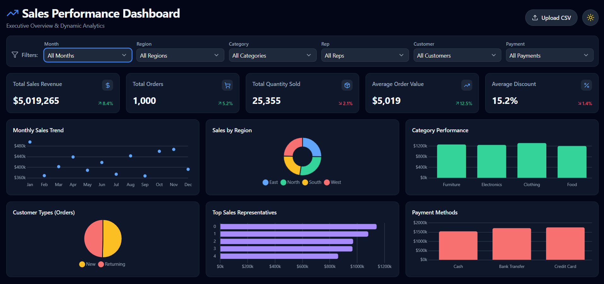

# Sales Analysis Project

This project contains a sales dataset, exploratory analysis notebooks, exported dashboard visuals, and an HTML dashboard for reviewing sales performance.

The main output is a **Sales Performance Dashboard** that gives an executive overview of sales revenue, order volume, product performance, regional sales, customer behavior, payment methods, and monthly trends.

## Dashboard Preview

## Project Files

| File | Description |
| --- | --- |
| `sales_data.csv` | Main sales dataset used for analysis. |
| `Sales.ipynb` | Jupyter notebook for sales data analysis. |
| `Sales_graphAnalysis.ipynb` | Jupyter notebook focused on graph and dashboard analysis. |
| `sales_dashboard_html.html` | HTML dashboard version of the analysis. |
| `Dashboard.png` | Dashboard screenshot/export. |
| `output.png` | Additional output visualization. |
| `sales amount distribution.png` | Sales amount distribution chart. |
| `payment method distribution.png` | Payment method distribution chart. |
| `sales by product cotogries.png` | Sales by product categories chart. |
| `Recording 2026-07-05 090300.mp4` | Screen recording of the dashboard or analysis workflow. |

## Dataset Overview

The dataset includes sales transaction details such as:

- Sale date
- Sales representative
- Region
- Sales amount
- Quantity sold
- Product category
- Unit cost and unit price
- Customer type
- Discount
- Payment method
- Sales channel

## Dashboard Overview

The dashboard is designed as an interactive executive sales report. It includes a dark modern interface with KPI cards, filters, and multiple charts that help compare business performance across different sales dimensions.

### Main KPI Cards

The dashboard highlights these important business metrics:

- **Total Sales Revenue:** `$5,019,265`
- **Total Orders:** `1,000`
- **Total Quantity Sold:** `25,355`
- **Average Order Value:** `$5,019`
- **Average Discount:** `15.2%`

These cards give a quick summary of the overall sales performance and include percentage indicators to show performance movement.

### Dashboard Filters

The dashboard includes filter controls for:

- Month
- Region
- Product category
- Sales representative
- Customer type
- Payment method

These filters make it easier to analyze specific parts of the business, such as one region, one month, one product category, or one customer segment.

### Visualizations Included

The dashboard contains the following charts:

- **Monthly Sales Trend:** Shows how sales changed from January to December.
- **Sales by Region:** Donut chart comparing East, North, South, and West region sales.
- **Category Performance:** Bar chart comparing Furniture, Electronics, Clothing, and Food sales.
- **Customer Types:** Pie chart comparing new and returning customers.
- **Top Sales Representatives:** Horizontal bar chart showing the best-performing sales reps.
- **Payment Methods:** Bar chart comparing Cash, Bank Transfer, and Credit Card sales.

## Key Insights From Dashboard

- Total sales revenue is above `$5 million`, showing strong overall business performance.
- The dashboard tracks `1,000` total orders and more than `25,000` units sold.
- Average order value is around `$5,019`, which helps measure customer spending per order.
- Product categories are fairly close in performance, with Clothing appearing slightly higher than the other categories.
- Credit Card and Bank Transfer payments show higher sales compared with Cash.
- The monthly sales trend shows visible changes across the year, helping identify stronger and weaker months.
- Customer orders are split between new and returning customers, which helps understand customer retention.

## Dashboard Features

- Clean executive dashboard layout
- Interactive CSV upload option
- Multiple dropdown filters
- KPI summary cards
- Trend, bar, pie, and donut charts
- Region-wise and category-wise performance comparison
- Customer and payment behavior analysis
- Dark theme for a professional dashboard look

## How To Use

1. Open `sales_dashboard_html.html` in a browser to view the dashboard.
2. Use the dropdown filters to explore data by month, region, category, sales rep, customer type, and payment method.
3. Use the **Upload CSV** button to upload a new or updated sales dataset if needed.
4. Open `Sales.ipynb` or `Sales_graphAnalysis.ipynb` in Jupyter Notebook, JupyterLab, or VS Code to review or update the analysis code.
5. Review the exported PNG files for saved chart outputs.

## Suggested Tools

- Python
- Jupyter Notebook or JupyterLab
- pandas
- matplotlib
- seaborn or plotly

## Project Purpose

This analysis helps understand sales trends across regions, product categories, payment methods, customer types, and sales channels. It can be used to identify strong-performing areas, compare customer behavior, and support business decision-making.
